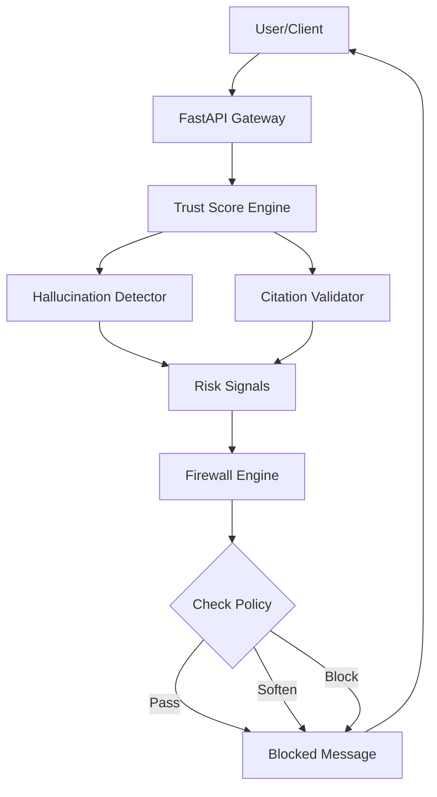

# AHTSE: AI Hallucination Firewall + Trust Score Engine

[](https://opensource.org/licenses/MIT)
[](https://www.python.org/downloads/)
[](https://github.com/psf/black)

AHTSE is a robust, local, and auditable safety layer designed to sit between Large Language Models (LLMs) and end-users. It detects hallucinations, computes a reliability "Trust Score," and enforces configurable firewall policies to prevent the propagation of unverified or risky information.

## 🚀 Key Features

*   **Hallucination Detection**: Utilizes heuristic analysis and mock embedding consistency checks to identify low-confidence or contradictory statements.
*   **Trust Score Engine**: Aggregates signals from multiple detectors to produce a single 0-100 reliability score.
*   **Configurable Firewall**: Enforces `Strict`, `Balanced`, or `Permissive` policies to Block, Soften, or Pass content based on risk thresholds.
*   **Citation Validation**: Verifies the presence and format of citations (Mock implementation for educational purposes).
*   **Audit Dashboard**: Real-time visualization of trust scores, risk factors, and firewall actions.
*   **Privacy-First**: Designed to run entirely locally with no external data leakage.

## 🏗️ Architecture

AHTSE follows a modular architecture with distinct engines for detection, scoring, and enforcement.



## 📂 Project Structure

```text
AHTSE/
├── backend/
│   ├── api/            # API Endpoints
│   ├── core/           # Config & Logging
│   ├── engines/        # Core Logic (Detector, TrustScore, Firewall)
│   └── main.py         # App Entry Point
├── frontend/           # Dashboard UI
├── tests/              # Pytest Suite
├── Makefile            # Automation
└── pyproject.toml      # Tool Configuration
```

## 🛠️ Installation

1.  **Clone the repository**:
    ```bash
    git clone https://github.com/yourusername/AHTSE.git
    cd AHTSE
    ```

2.  **Install dependencies**:
    ```bash
    make install
    ```

## 🚦 Usage

1.  **Start the Server**:
    ```bash
    make run
    ```
    The API will be available at `http://localhost:8000`.

2.  **Access the Dashboard**:
    Open your browser to `http://localhost:8000` to interact with the system.

3.  **API Documentation**:
    Visit `http://localhost:8000/docs` for the interactive Swagger UI.

## 🧪 Testing

Run the comprehensive test suite using `pytest`:

```bash
make test
```

## 🛡️ Security & Limitations

*   **Mock Components**: This project is an educational prototype. The embedding model and citation verification are **mocks** and should be replaced with real models (e.g., SentenceTransformers, Google Search API) for production use.
*   **Local Execution**: No data is sent to external servers.
*   **No Personal Data**: The system does not persist user data.

## 🤝 Contributing

Contributions are welcome! Please read [CONTRIBUTING.md](CONTRIBUTING.md) for details on our code of conduct and the process for submitting pull requests.

## 📄 License

This project is licensed under the MIT License - see the [LICENSE](LICENSE) file for details.
